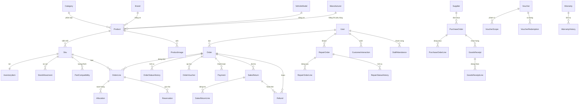

# Tài liệu thiết kế (Design) — Hệ thống MoToSale v2

Phiên bản: 1.0 · Ngày: 04/06/2026 · Đi kèm: `V2_SRS_REQUIREMENTS.md`

Mục lục:
1. Tổng quan thiết kế
2. Kiến trúc hệ thống
3. Thiết kế cơ sở dữ liệu (ERD + mô tả bảng)
4. Đặc tả API
5. Thiết kế giao diện (UI/UX)

---

## 1. Tổng quan thiết kế

- **Mô hình**: kiến trúc **microservices** sau một **API Gateway**, dùng **chung một CSDL** SQL Server; frontend **SPA React** cho khu quản trị.
- **Công nghệ**: .NET 8, ASP.NET Core, EF Core (code-first), SQL Server LocalDB (`MoToSaleV2`); React + Vite + Tailwind/AdminLTE; xác thực JWT.
- **Nguyên tắc**: phân lớp rõ ràng (Common → Entities → DTO → Repository → Services → API), **sổ cái bất biến** cho kho/quỹ, **một kho duy nhất**, dữ liệu tiền/tồn/công nợ nhất quán qua transaction.

---

## 2. Kiến trúc hệ thống

### 2.1 Sơ đồ thành phần

```
                ┌─────────────────────────┐
                │   Frontend Admin (SPA)   │  React + Vite + Tailwind
                │   v2/frontend-admin      │  axios + JWT (localStorage)
                └────────────┬────────────┘
                             │  HTTPS/JSON (tiếng Việt qua adapter)
                             ▼
                ┌─────────────────────────┐
                │     ApiGateway :5100     │  Ocelot reverse-proxy
                │  định tuyến theo path    │
                └─────┬───────────────┬────┘
        /api/auth/*   │               │   (mọi route nghiệp vụ khác)
        /api/users/*  ▼               ▼
        ┌────────────────────┐  ┌────────────────────┐
        │ AuthService :5101  │  │  APIService :5102   │
        │ đăng nhập, JWT,    │  │ catalog, order, kho,│
        │ tài khoản, vai trò │  │ thanh toán, dịch vụ,│
        └─────────┬──────────┘  │ báo cáo, cấu hình   │
                  │             └─────────┬──────────┘
                  └──────────┬────────────┘
                             ▼
              ┌──────────────────────────────┐
              │  SQL Server LocalDB           │
              │  Database: MoToSaleV2         │  (EF Core code-first + Migrations)
              └──────────────────────────────┘
```

### 2.2 Vai trò các service
| Service | Cổng | Trách nhiệm |
|---|---|---|
| **ApiGateway** (Ocelot) | 5100 | Điểm vào duy nhất; định tuyến `/api/auth/*`, `/api/users/*` → AuthService, phần còn lại → APIService; chuyển tiếp JWT |
| **AuthService** | 5101 | Đăng nhập, phát hành/*validate* JWT, quản lý tài khoản & vai trò, đổi mật khẩu |
| **APIService** | 5102 | Toàn bộ nghiệp vụ: danh mục/sản phẩm, kho, đơn hàng/POS, thanh toán, đổi trả, bảo hành, sửa chữa, CSKH, cung ứng, tài chính, báo cáo, cấu hình, kiểm toán |

### 2.3 Phân lớp (shared libraries)
| Lớp (project) | Vai trò |
|---|---|
| `MoToSale.Common` | BaseEntity, enum/hằng trạng thái, JWT helper, PasswordHasher, AppSettings |
| `MoToSale.Entities` | Thực thể domain (POCO) — ánh xạ bảng |
| `MoToSale.DTO` | Request/Response DTO trao đổi với FE |
| `MoToSale.Repository` | `AppDbContext`, `Repository<T>` generic, `IUnitOfWork` (transaction), audit hook |
| `MoToSale.Services` | Logic nghiệp vụ theo domain (Catalog/Ordering/Inventory/Payments/Operations/Reports) |
| `MoToSale.*Service` (host) | Controller + DI + middleware của từng microservice |

### 2.4 Luồng xử lý một yêu cầu (ví dụ tạo đơn POS)
1. FE gọi `POST /api/orders/pos` kèm `Authorization: Bearer <JWT>`.
2. Gateway định tuyến → APIService; middleware xác thực JWT, gắn `User`/`Role`.
3. Controller → `OrderService.CreatePosOrderAsync` chạy trong **transaction** (`IUnitOfWork.ExecuteInTransactionAsync`).
4. Service: kiểm tồn khả dụng → tạo `Order`+`OrderLine` → ghi `StockMovement`(Issue)/`Reservation` → cập nhật `InventoryItem` → ghi `Payment`+`CashTransaction` → cập nhật trạng thái.
5. `SaveChanges` kích hoạt **CaptureAuditLogs** ghi `AuditLog` cho mọi thay đổi BaseEntity.
6. Trả DTO; adapter FE dịch khóa Anh→Việt để hiển thị.

### 2.5 Quy ước chung
- **BaseEntity**: `Id, CreatedDate, UpdatedDate, Status` (`Active=1/Inactive=0/Deleted=-1`) → hỗ trợ **xóa mềm**.
- **Mã chứng từ** sinh theo thời gian có mili-giây: `DH/POS/…{yyyyMMddHHmmssfff}` (tránh trùng khóa).
- **Snapshot**: dòng đơn lưu `ProductNameSnapshot`/`SkuCodeSnapshot`, voucher lưu `VoucherCodeSnapshot` → bất biến theo lịch sử.

---

## 3. Thiết kế cơ sở dữ liệu

### 3.1 Nhóm bảng (≈ 50 bảng)
| Nhóm | Bảng |
|---|---|
| **Identity** | Users, Roles, UserRoles, Addresses |
| **Catalog** | Categories, Brands, VehicleModels, Manufacturers, Products, Skus, ProductImages, ProductRelatedItems, PartCompatibilities, Reviews |
| **Inventory** | InventoryItems, StockMovements, StockDocuments, StockDocumentLines, Reservations |
| **Ordering** | Carts, CartItems, Orders, OrderLines, Allocations, OrderStatusHistories, Vouchers, VoucherScopes, VoucherRedemptions, OrderVouchers, Warranties, WarrantyHistories |
| **Payments** | Payments |
| **Operations** | SalesReturns, SalesReturnLines, Refunds, Suppliers, PurchaseOrders, PurchaseOrderLines, GoodsReceipts, GoodsReceiptLines, CashTransactions, RepairOrders, RepairOrderLines, RepairStatusHistories, CustomerInteractions, StaffShifts, StaffAttendances |
| **Content** | Posts, Faqs, ContactRequests, HomeBanners |
| **System** | Settings, AuditLogs |

### 3.2 ERD lõi (Mermaid)



> Quan hệ kho–tiền (StockMovement, CashTransaction, AuditLog) dùng cặp **RefType/RefId** (liên kết mềm) để trỏ về chứng từ nguồn (Order, StockDocument, SalesReturn…), không ràng buộc khóa ngoại cứng — phù hợp sổ cái append-only.

### 3.3 Mô tả các bảng chính

**Products** — sản phẩm. `Code, Name, Slug, CategoryId, BrandId?, VehicleModelId?, ManufacturerId?, Kind(1=Xe,2=Phụ tùng), IsFeatured, IsHotDeal`. Xóa = mềm (Status=Inactive).

**Skus** — biến thể bán. `ProductId, SkuCode, VariantName, Color, Version, ListPrice, SalePrice?, Barcode`.

**InventoryItems** — tồn theo SKU (1-1). `SkuId, OnHand, Reserved, ReorderPoint`; **Available = OnHand − Reserved** (tính, không lưu).

**StockMovements** — sổ cái kho **append-only**. `SkuId, Type(Receipt/Issue/Adjust/Reserve…), QtyDelta, BalanceAfter, RefType, RefId, Reason, PerformedBy, OccurredAt`.

**Reservations** — giữ chỗ cho đơn cọc. `OrderId, OrderLineId, SkuId, Qty, ReservationStatus(Active/Confirmed/Released/Expired), ExpiresAt`.

**Orders** — đơn hàng (online + POS). `Code, UserId, Channel(Online/InStore), OrderType(FullPayment/Deposit/Installment), OrderStatus, PaymentStatus, FulfillmentStatus, Subtotal, DiscountTotal, ShippingFee, GrandTotal, DepositAmount, RemainingAmount, Shipping*, ReceivingMethod(Delivery/Pickup), PlacedAt`.

**OrderLines** — dòng đơn. `OrderId, SkuId, ProductNameSnapshot, SkuCodeSnapshot, UnitPrice, Qty, LineTotal`.

**Payments** — phiếu thu của đơn (ghi tay). `Code, OrderId, PaymentType(Deposit/Full/Remaining/Installment), Amount, Method, PaymentRecordStatus, PaidAt, RecordedBy`.

**CashTransactions** — sổ quỹ thu/chi. `Code, TransactionType(Receipt/Payment), Category(CustomerPayment/Refund/SupplierPayment…), Amount, Method, ReferenceType, ReferenceId, OccurredAt`.

**SalesReturns / SalesReturnLines / Refunds** — đổi trả → hoàn tiền. Return: `Code, OrderId, ReturnStatus, Reason, RefundAmount, ApprovedBy/At`; Line: `OrderLineId, SkuId, Qty, ItemCondition(Resellable/Damaged/Warranty)`; Refund: `Code, OrderId, SalesReturnId?, Amount, Method, RefundStatus, RefundedAt`.

**Vouchers** — mã giảm giá. `Code, DiscountType(Percent/Amount), DiscountValue, MaxDiscount?, MinOrderValue, UsageLimit?, PerUserLimit?, UsedCount, StartAt, EndAt`. Xóa bị chặn khi `UsedCount>0`.

**Warranties / WarrantyHistories** — bảo hành. `Code, OrderId?, SkuId?, CustomerId?, ProductSnapshot, FrameNumber, EngineNumber, ReportedIssue, EstimatedCost?, ActualCost?, Months, StartAt, WarrantyStatus, ReceivedAt, CompletedAt`.

**Suppliers / PurchaseOrders / PurchaseOrderLines / GoodsReceipts / GoodsReceiptLines** — cung ứng. PO: `Code, SupplierId, PurchaseStatus(Draft/Approved/…), TotalAmount, PaidAmount`; POL: `SkuId, OrderedQty, ReceivedQty, UnitCost`; GR/GRL ghi nhận nhập kho thực tế (nguồn tính **giá vốn bình quân** cho COGS).

**RepairOrders / RepairOrderLines / RepairStatusHistories** — sửa chữa. RO: `Code, CustomerId, AssignedStaffId?, WarrantyId?, VehicleDescription, ReportedIssue, RepairStatus, LaborCost, PartsCost, PartsIssued, ReceivedAt, CompletedAt`.

**CustomerInteractions** — CSKH. `CustomerId, AssignedStaffId?, InteractionType, InteractionStatus, Subject, FollowUpAt, CompletedAt`.

**StaffShifts / StaffAttendances** — phân ca & chấm công. Attendance: `StaffUserId, CheckInAt, CheckOutAt?, Note`.

**Users / Roles / UserRoles** — tài khoản & vai trò (Admin/Staff/Customer). `FullName, Email, PhoneNumber, PasswordHash(PBKDF2), CareNote`.

**Settings** — cấu hình vận hành (key/value). **AuditLogs** — nhật ký mọi thay đổi.

### 3.4 Bảng trạng thái (state values)
Trạng thái đơn được tách thành **2 trục độc lập**: trạng thái đơn/giao hàng và trạng thái thanh toán. Việc thu/hoàn tiền **không** tự đổi trạng thái đơn (admin chủ động duyệt giao), tránh phụ thuộc chéo gây sai lệch.

| Lĩnh vực | Giá trị |
|---|---|
| **OrderStatus** (giao/nhận) | `Pending` (Chờ xác nhận) · `Shipping` (Đang giao) · `Delivered` (Đã giao = hoàn tất bán hàng) · `Cancelled` (Đã hủy) |
| **PaymentStatus** (thanh toán) | `Unpaid` (Chờ thanh toán — gồm cả đơn mới đặt cọc) · `PendingConfirmation` (Chờ xác nhận chuyển khoản) · `Paid` (Đã thanh toán) · `Refunded` (Đã hoàn tiền) · `Failed` (Thanh toán thất bại) |
| FulfillmentStatus | Unallocated · Allocated · Shipped · Fulfilled |
| OrderType | FullPayment · Deposit · Installment |
| StockMovementType | Receipt · Issue · AdjustIn/Out · TransferIn/Out · ReserveHold/Release |
| ReservationStatus | Active · Confirmed · Released · Expired |

**Ghi chú đặt cọc:** tính năng đặt cọc vẫn hỗ trợ (theo dõi `DepositAmount`/`RemainingAmount` + phiếu thu), nhưng **không** thể hiện thành trạng thái riêng — đơn chưa thu đủ là `Unpaid`, thu đủ là `Paid`.

**Mapping nghiệp vụ chuẩn:**
| Tình huống | OrderStatus | PaymentStatus |
|---|---|---|
| Đơn online/COD vừa tạo | Pending | Unpaid |
| Khách báo đã chuyển khoản | Pending | PendingConfirmation |
| Admin đối soát đủ tiền | Pending | Paid |
| Admin duyệt giao | Shipping | (giữ nguyên) |
| Giao xong (COD thu tiền khi giao) | Delivered | Paid |
| POS bán đứt | Delivered | Paid |
| Hủy đơn chưa thu | Cancelled | Unpaid / Failed |
| Hủy đơn đã thu (hoàn tiền) | Cancelled | Refunded |
| Đổi trả sau giao | Delivered (giữ) | quản lý ở phiếu đổi trả/hoàn tiền riêng |

---

## 4. Đặc tả API

### 4.1 Quy ước
- REST/JSON qua Gateway `:5100`, tiền tố `/api`. Xác thực: `Authorization: Bearer <JWT>`.
- Phân quyền theo vai trò ở controller (Admin-only cho tài chính/tài khoản/cung ứng/cấu hình/import/nhật ký).
- **Swagger UI** mô tả đầy đủ tham số/response — bật ở mỗi service (`/swagger`); dùng làm đặc tả chi tiết kèm theo.

### 4.2 Các nhóm endpoint chính
| Nhóm | Phương thức & đường dẫn tiêu biểu | Quyền |
|---|---|---|
| Xác thực | `POST /api/auth/login`, `POST /api/auth/change-password` | Công khai/đăng nhập |
| Tài khoản | `GET/POST/PUT /api/users`, `DELETE /api/users/{id}` (chặn nếu có đơn) | Admin |
| Danh mục | `GET/POST/PUT/DELETE /api/categories \| /brands \| /models \| /manufacturers` | Admin |
| Sản phẩm | `GET/POST/PUT /api/products`, `DELETE` (xóa mềm); SKU/ảnh/tương thích/bán kèm | Admin |
| Tra cứu | `GET /api/catalog-lookup`, `GET /api/customers` | Admin/Staff |
| Đơn hàng | `GET /api/orders`, `GET /api/orders/{id}`, `POST /api/orders/pos`, `PUT /api/orders/{id}`, `POST /api/orders/{id}/fulfill` | Admin/Staff |
| Thanh toán | `POST /api/payments`, `POST /api/payments/{id}/cancel` | Admin/Staff |
| Voucher | `GET/POST/PUT /api/vouchers`, `DELETE` (chặn nếu đã dùng) | Admin |
| Kho | `GET /api/inventory`, điều chỉnh tồn, chứng từ kho + duyệt, movements | Admin |
| Đổi trả | `POST /api/operations/returns`, `…/approve`, `…/reject` | Admin/Staff |
| Bảo hành | `GET/POST /api/warranties`, `PUT /api/warranties/{id}`, chuyển trạng thái | Admin/Staff |
| Vận hành | `…/business-operations/repairs` (+`PUT /repairs/{id}`), `/customer-interactions`, `/attendance` | Admin/Staff |
| Cung ứng | `…/suppliers`, `/purchase-orders` (+duyệt/nhận hàng/thanh toán) | Admin |
| Tài chính | `…/cash-transactions` (+đảo phiếu), `/receivables` | Admin |
| Báo cáo | `GET /api/reports/dashboard`, `GET /api/reports?from&to` | Admin |
| Cấu hình | `GET/PUT /api/operations-config` (Settings) | Admin |
| Kiểm toán | `GET /api/audit-logs` | Admin |

### 4.3 Mẫu hợp đồng (ví dụ POS)
`POST /api/orders/pos`
```json
{
  "customerId": 12,                 // null = khách lẻ
  "orderType": "Deposit",           // FullPayment | Deposit | Installment
  "depositAmount": 5000000,
  "voucherCode": "SALE10",
  "paymentMethod": "Cash",
  "lines": [{ "skuId": 101, "qty": 1, "unitPrice": 30000000 }]
}
```
→ `201`: Order kèm `code, orderStatus, paymentStatus, fulfillmentStatus, grandTotal, remainingAmount`.

---

## 5. Thiết kế giao diện (UI/UX)

### 5.1 Bố cục
- **AdminLTE/Bootstrap + Tailwind**: header + **sidebar trái** + vùng nội dung; route **lazy-load** (React.lazy) giảm tải khởi động.
- **Adapter axios**: tự dịch khóa Việt↔Anh giữa FE và API → UI thuần tiếng Việt, tiền VNĐ, ngày giờ định dạng VN.

### 5.2 Menu 5 nhóm (theo domain)
| Nhóm | Trang chính |
|---|---|
| **Bán hàng** | Bán tại quầy (POS), Đơn hàng, Khách hàng, Voucher |
| **Sản phẩm & Kho** | Sản phẩm, Danh mục/Hãng/Dòng/Hãng SX, Tồn kho, Chứng từ kho, Cung ứng/Nhà cung cấp |
| **Dịch vụ & Hậu mãi** | Đổi trả & hoàn tiền, Bảo hành, Sửa chữa, CSKH |
| **Tài chính & Báo cáo** | Sổ quỹ thu/chi, Công nợ, Báo cáo (doanh thu/lãi gộp/COGS) |
| **Hệ thống** | Tài khoản & vai trò, Phân ca/Chấm công, Cấu hình, Nhật ký kiểm toán |

### 5.3 Màn hình tiêu biểu
- **POS**: tìm SKU (mã/tên/barcode), giỏ hàng chỉnh SL/giá, ô tra **khách quen** theo SĐT (dropdown đồng đều, ellipsis), chọn bán đứt/đặt cọc, áp voucher, in **Hóa đơn VAT**.
- **Chi tiết đơn**: tóm tắt tiền/công nợ, **dòng thời gian trạng thái**, nút **Ghi nhận thanh toán** (loại theo trạng thái), **Giao hàng & xuất kho**, **Sửa đơn** (mở khi đủ điều kiện), in hóa đơn.
- **Tồn kho**: bảng Tồn thực/Đang giữ/Khả dụng/Ngưỡng, cảnh báo dưới ngưỡng, xuất Excel.
- **Báo cáo**: thẻ tổng quan (doanh thu, lãi gộp, COGS) + biểu đồ + bảng top sản phẩm; lọc theo kỳ; xuất Excel.

### 5.4 Nguyên tắc UX
- Trạng thái **đang tải / rỗng / lỗi** rõ ràng; xác nhận trước thao tác phá hủy.
- Nút hành động **hiện theo điều kiện** (chỉ cho phép khi nghiệp vụ hợp lệ) — tránh thao tác sai trạng thái.
- Mã màu trạng thái nhất quán (chờ/đang xử lý/hoàn tất/hủy).
- Hóa đơn VAT & phiếu in qua `window.print` (mẫu trong `utils/vatInvoice.js`, có số tiền bằng chữ).
